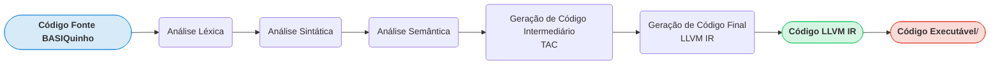
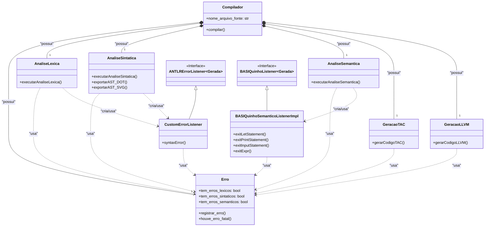
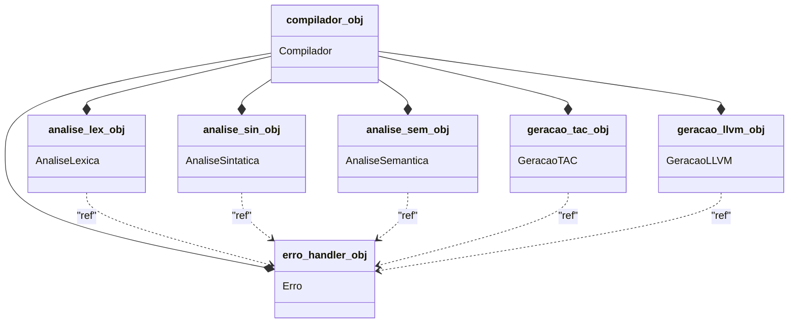
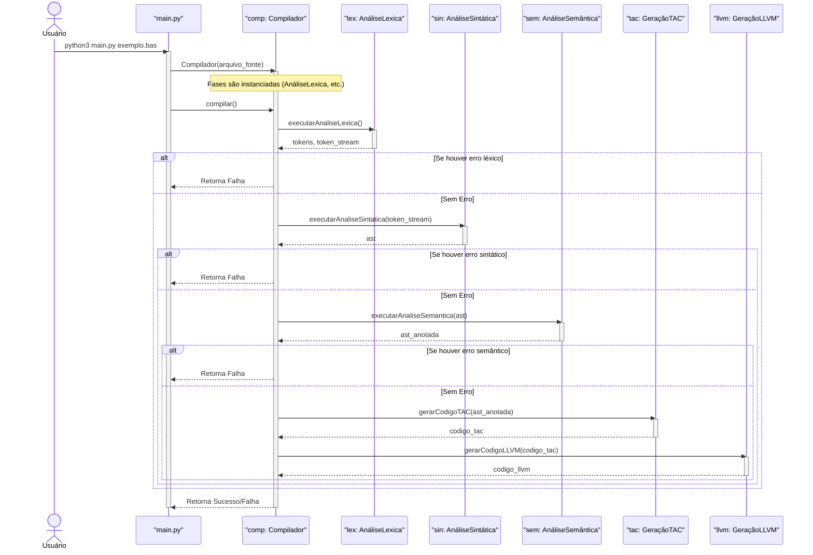
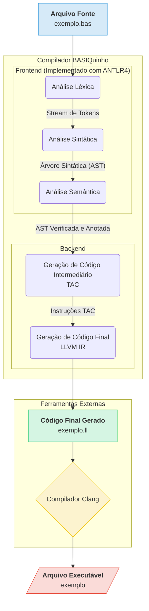

# README.md

**Nota:** A estrutura e o conteúdo deste arquivo README.md foram elaborados com o auxílio de uma Inteligência Artificial.

---

## 🚀 Compilador BASIQuinho 👨‍🏫

Bem-vindo ao repositório do Compilador BASIQuinho! Este projeto é um compilador pedagógico desenvolvido em Python 3 para um subconjunto da linguagem BASIC, carinhosamente chamado de "BASIQuinho". O objetivo principal é servir como ferramenta de aprendizado para estudantes de Engenharia da Computação nas disciplinas de compiladores, demonstrando todas as fases clássicas da compilação, desde a análise léxica até a geração de código de baixo nível (LLVM IR).

Link do Repositório: [Github](https://github.com/edwilsonferreira/BASIQuinho)

---

## 📋 Tabela de Conteúdos

[✨ 1 Funcionalidades da Linguagem BASIQuinho](#1)  
[🏗️ 2 Arquitetura do Compilador](#2)  
[🧩 3 Estrutura do Projeto e Módulos](#3)  
[🛠️ 4 Configuração e Instalação](#4)  
[▶️ 5 Como Executar o Compilador](#5)  
[⚙️ 6 Compilando e Executando o Código Gerado](#6)  
[📂 7 Exemplos](#7)  

---

<a id="1"></a>

## ✨ 1 Funcionalidades da Linguagem BASIQuinho

O BASIQuinho atualmente suporta os seguintes comandos e construções:

* ```PRINT <expr_list>```: Escreve o valor de uma ou mais expressões (separadas por vírgula) na saída padrão.
  * Ex: ```PRINT "Olá Mundo!"```
  * Ex: ```PRINT "Valor: ", MINHA_VAR, 10 * 2```
* ```INPUT <variável>```: Lê um valor numérico da entrada padrão e o armazena na variável especificada.
  * Ex: ```INPUT IDADE```
* ```LET <variável> = <expressão>```: Atribui o resultado de uma expressão a uma variável.
  * Ex: ```LET X = 10```
  * Ex: ```LET RESULTADO = (A + B) * (C / 2)```
* **Expressões Aritméticas**: Suporte a ```+```, ```-```, ```*```, ```/``` com precedência usual e uso de parênteses ```()```.
* **Tipos de Dados**: Suporte implícito a números e strings literais. As variáveis assumem o tipo do valor atribuído.
* **Comentários**: Linhas iniciadas com a palavra-chave REM (Remark) são ignoradas.
  * Ex: ```REM Isto é um comentário de linha inteira```
  * Ex: ```LET A = 10 REM Comentário no fim da linha```
* **Terminador de Comando**: Comandos podem ser terminados por uma nova linha ou por um ponto e vírgula (```;```).
* **Linhas em Branco**: Linhas em branco no código fonte são ignoradas.

---

<a id="2"></a>

## 🏗️ 2 Arquitetura do Compilador

O compilador BASIQuinho segue as fases tradicionais de um compilador, transformando o código de alto nível em um executável.

**Visão Geral**


**Diagrama de Classes**

Este diagrama mostra as principais classes do projeto e seus relacionamentos, como herança e associação. Ele descreve a arquitetura estática do compilador.

* A classe ```Compilador``` atua como o orquestrador central, compondo (relação "tem um") instâncias de cada fase da compilação.
* Cada fase usa uma referência à instância única da classe ```Erro``` para reportar problemas de forma centralizada.
As classes ```CustomErrorListener``` e ```BASIQuinhoSemanticoListenerImpl``` herdam de classes base geradas pelo ```ANTLR4``` para estender sua funcionalidade.




**Diagrama de Objetos**
Este diagrama é uma "fotografia" do sistema durante a execução. Ele mostra as instâncias específicas das classes (os objetos) e como elas estão conectadas.

* O objeto ```compilador_obj``` é a instância principal criada em ```main.py```.
* Ele cria e "possui" um objeto para cada fase (ex: ```analise_lex_obj```, ```analise_sin_obj```) e um único ```erro_handler_obj```.
* Todos os objetos de fase mantêm uma referência (link) para o mesmo ```erro_handler_obj```, garantindo que todos os erros sejam reportados de forma unificada.    



**Diagrama de Sequência para o Processo de Compilação**

Este diagrama ilustra a sequência de chamadas de método que ocorrem quando ```main.py``` é executado. Ele mostra o objeto ```Compilador``` chamando cada fase em ordem e o fluxo de dados (```stream de tokens```, ```AST````).

Explicação do Diagrama de Sequência:

* Participantes (```Lifelines```): As colunas verticais representam os objetos que participam da interação (```Usuário```, ```main.py```, ```compilador_obj```, e os objetos de cada fase).
Mensagens (```Setas```):
* As setas cheias (```->>```) representam chamadas de método síncronas (a execução espera a chamada terminar).
* As setas pontilhadas (```-->>```) representam os valores de retorno.
* Ativação (```Barras Verticais```): As barras retangulares nas linhas de vida indicam que um objeto está "ativo", ou seja, executando um método.
* Bloco ```alt```: Representa um fluxo alternativo. Neste caso, ele mostra a lógica principal do seu compilador: se uma fase crucial (```léxica```, ```sintática```, ```semântica```) falhar, o processo é interrompido; caso contrário (else), ele continua para a próxima fase.



---

<a id="3"></a>

## 🧩 3 Estrutura do Projeto e Módulos
O projeto é organizado em módulos Python, cada um responsável por uma fase ou funcionalidade específica:

1. ```BASIQuinho.g4```
   * Função: Arquivo de gramática formal da linguagem BASIQuinho, escrito na sintaxe do ANTLR4.
   * Responsabilidade: Define as regras léxicas (tokens) e sintáticas (estrutura de comandos e expressões). É a especificação formal do software que o ANTLR4 utiliza para gerar os analisadores.
2. Integração com ANTLR4
O ANTLR4 (ANother Tool for Language Recognition) é usado para gerar o analisador léxico e sintático a partir da gramática.




3. ```main.py```

* **Função:** Ponto de entrada principal do compilador.
* **Responsabilidade:** Processa os argumentos da linha de comando, instancia a classe Compilador e inicia a compilação.

4. ```compilador.py```
* **Função:** Orquestrador central do processo de compilação.
* **Responsabilidade:** Coordena a execução sequencial de todas as fases, gerencia a passagem de dados entre elas (tokens, AST, TAC) e centraliza a interface com o usuário.

5. ```logger_config.py``` e ```erro.py```
* **Função:** Módulos de suporte.
* **Responsabilidade:** ```logger_config.py``` configura um sistema de log detalhado para todas as fases. ```erro.py``` centraliza o registro e o tratamento de erros léxicos, sintáticos e semânticos.

6. ```analise_lexica.py```
* **Função:* Executa a Análise Léxica.
* **Responsabilidade:** Usa o BASIQuinhoLexer para converter o código fonte em uma sequência de tokens.

7. ```analise_sintatica.py```
* **Função:** Executa a Análise Sintática.
* **Responsabilidade:**  Usa o BASIQuinhoParser para validar a sequência de tokens e construir a Árvore Sintática (AST/Parse Tree).

8. ```analise_semantica.py```
* **Função:** Executa a Análise Semântica.
* **Responsabilidade:** Percorre a AST para verificar a consistência semântica do código, como uso de variáveis e compatibilidade de tipos.

9. ```geracao_tac.py``` (Geração de Código de Três Endereços) ⚙️
* **Função:** Primeira fase da síntese de código, gerando uma representação intermediária de baixo nível.

**Explicação Técnica Detalhada da Implementação**
A geração de TAC é o processo de "achatar" a árvore sintática (AST), que é hierárquica, em uma sequência linear de instruções simples. Esta representação intermediária (IR) é mais próxima do código de máquina, mas ainda é independente da arquitetura do processador.

**Estratégia de Implementação:**

A implementação no BASIQuinho utiliza uma abordagem de travessia de árvore com recursão, que funciona de forma similar a um padrão de projeto Visitor. O método principal é o gerarCodigoTAC, que itera sobre os statements do programa, e para cada expressão, chama uma função auxiliar recursiva, a ```_gerar_tac_expr_recursivo```.

**Geração de TAC: ```_gerar_tac_expr_recursivo```**

Esta função é a peça central da tradução de expressões. Ela navega pela sub-árvore de uma expressão e implementa uma travessia em pós-ordem (post-order traversal):

**Visita os filhos de um nó (os operandos).**
Processa o próprio nó (o operador).
O retorno da função é sempre uma string que representa o "endereço" do resultado da sub-expressão analisada. Este endereço pode ser:
  * O nome de uma variável (ex: ```NUM1```).
  * Um literal numérico (ex: ```2```).
  * O nome de uma variável temporária recém-criada (ex: ```t0```, ```t1```).

**Exemplo de Geração para uma Expressão:**

Seja a geração para o comando ```LET RESULT = (A + 5) * B```:

O método gerarCodigoTAC identifica o LetStatement e invoca _gerar_tac_expr_recursivo para o nó da expressão ```(A + 5) * B```.

```_gerar_tac_expr_recursivo para (A + 5) * B```:

* O nó raiz é ```*```. A função primeiro visita os filhos.
* Chamada recursiva para ```(A + 5)```:
* O nó raiz agora é ```+```. A função visita os filhos de ```+```.
* Chamada recursiva para ```A -> retorna "A"```.
* Chamada recursiva para ```5 -> retorna "5"```.
* Processa o ```+```: cria a temporária t0, gera a instrução ```t0 := A + 5``` e retorna ```t0```.
* A chamada original para ```*``` agora tem o resultado do operando esquerdo (```t0```).
* Chamada recursiva para ```B -> retorna "B"```.
* Processa o ```*```: cria a temporária ```t1```, gera a instrução ```t1 := t0 * B``` e retorna ```t1```.
* O ```gerarCodigoTAC``` recebe de volta ```t1``` e gera a instrução de atribuição final: ```RESULT := t1```.

Resultado Final do TAC:

```
t0 := A + 5
t1 := t0 * B
RESULT := t1
```

10. ```geracao_llvm.py``` (Geração de Código LLVM IR) 🔩
* **Função:** Fase final da compilação, traduzindo o código intermediário (TAC) para LLVM Intermediate Representation (IR).

**Explicação Técnica Detalhada da Implementação**
A geração de código final é onde a representação abstrata do programa se torna algo concreto que pode ser executado. Optou-se por gerar LLVM IR para aproveitar todo o poder do ecossistema LLVM.

**Estratégia de Implementação:**

A classe GeracaoLLVM implementa um tradutor que percorre a lista de instruções TAC e converte cada uma delas em uma ou mais instruções LLVM IR.

O Processo de Tradução TAC para LLVM:

Parse da Instrução TAC: Cada linha do TAC (ex: ```t0 := A + B```) é dividida em seus componentes: destino, operador e operandos.

**Mapeamento de Variáveis e Alocação:**

* **alloca:** Variáveis do ```BASIQuinho``` são alocadas na stack (pilha de execução) da função main usando a instrução alloca.
* **Tabela de Símbolos LLVM (var_map):** Um dicionário mapeia o nome de uma variável BASIQuinho para seu ponteiro na stack LLVM (ex: ```NUM1 -> %ptr.NUM1```).
* **Tipagem Estática do LLVM:** O LLVM possui tipagem estática forte. No ```BASIQuinho```, assumiu-se que as variáveis numéricas são do tipo ```i32``` e as strings são ```ptr``` (ponteiros).

**Tradução de Operações:**

* ```load``` e ```store```: Para usar o valor de uma variável, ele é carregado da memória para um registrador virtual com load. Para atribuir um valor a uma variável, ele é armazenado no endereço da variável com store.
* **Instruções Aritméticas:** As operações do TAC (```+```, ```-```, ```*```, ```/```) são mapeadas para suas instruções LLVM correspondentes (```add```, ```sub```, ```mul```, ```sdiv```).

**Tradução de I/O:**

```PRINT``` e ```INPUT```: São traduzidos para chamadas a funções da biblioteca C padrão, como ```printf``` e ```scanf```.
* **Strings Globais:** Strings literais usadas em PRINT são criadas como constantes globais (ex: ```@.str.const.0```).

**Exemplo de Tradução TAC -> LLVM IR:**

Código de Três Endereços (TAC):

```bash
t0 := A + 5
RESULT := t0
```

Código LLVM IR Gerado (essência):

```bash
define i32 @main() {
entry:
  ; 1. Aloca espaço para as variáveis na stack.
  %ptr.A = alloca i32, align 4
  %ptr.RESULT = alloca i32, align 4

  ; --- Tradução de t0 := A + 5 ---
  ; 2. Carrega o valor da variável 'A' da memória para um registrador temporário '%r0'.
  %r0 = load i32, ptr %ptr.A, align 4

  ; 3. Executa a adição entre o valor carregado (%r0) e o literal 5.
  ;    O resultado é colocado no registrador virtual %t0.
  %t0 = add nsw i32 %r0, 5

  ; --- Tradução de RESULT := t0 ---
  ; 4. Armazena o valor do registrador %t0 no endereço de memória da variável 'RESULT'.
  store i32 %t0, ptr %ptr.RESULT, align 4
  
  ret i32 0

```

---

<a id="4"></a>

## 🛠️ 4 Configuração e Instalação

Procedimentos de configuração do ambiente para execução do compilador BASIQuinho.

* **Pré-requisitos**
  * ✅ Python 3: Versão 3.7 ou superior.
  * ✅ Java Development Kit (JDK): Versão 8 ou superior (para executar o ANTLR4).
  * ✅ ANTLR4:
    * Faça o download do JAR do ANTLR4 (ex: antlr-4.13.2-complete.jar) em antlr.org.
    * Coloque o arquivo .jar no diretório raiz do projeto.
  * ✅ Runtime ANTLR4 para Python 3: (recomenda-se usar um ambiente virtual venv)

      ```bash python3 -m pip install antlr4-python3-runtime```

  * ✅ Clang (ou GCC): Necessário para compilar o código LLVM IR gerado.
  * ✅ (Opcional) Graphviz: Para visualizar a Árvore Sintática (.svg).

**Geração do Parser com ANTLR4** 
Sempre que o arquivo de gramática BASIQuinho.g4 for modificado, você precisa (re)gerar os arquivos do parser:

No diretório raiz do projeto, execute o comando:

```bash
java -jar antlr-4.13.2-complete.jar -Dlanguage=Python3 BASIQuinho.g4
```

---
<a id="5"></a>

## ▶️ 5 Como Executar o Compilador

Após configurar o ambiente e gerar os arquivos do parser, execute o script ```main.py``` passando o caminho para o seu arquivo de código BASIQuinho como argumento:


```bash
python3 main.py caminho/para/seu_arquivo.bas
```

Por exemplo:

```bash
python3 main.py exemplos/exemplo3.bas
```

O compilador irá processar o arquivo e gerar os seguintes artefatos no mesmo diretório do arquivo de entrada:

```<nome_do_arquivo>.dot```: Representação da Árvore Sintática para Graphviz.
```<nome_do_arquivo>.svg```: Imagem SVG da Árvore Sintática (requer Graphviz).
```<nome_do_arquivo>.tac```: Código de Três Endereços gerado.
```<nome_do_arquivo>.ll```: Código LLVM IR gerado.

---

<a id="6"></a>

## ⚙️ 6 Compilando e Executando o Código Gerado
Após o compilador BASIQuinho gerar um arquivo ```.ll```:

Use o Clang para compilar o arquivo .ll em um executável:

```bash
clang seu_arquivo.ll -o seu_executavel
```

Execute o programa:

```bash
./seu_executavel```
```

---

<a id="7"></a>

## 📂 Exemplos

O diretório ```exemplos/``` contém arquivos de código BASIQuinho para teste. O ```exemplo3.bas``` é o mais completo e recomendado para um teste geral de funcionalidades.

---
👨‍💻 Autor Prof. Dr. Ed Wilson Tavares Ferreira
GitHub: [edwilsonferreira](https://github.com/edwilsonferreira/BASIQuinho)
